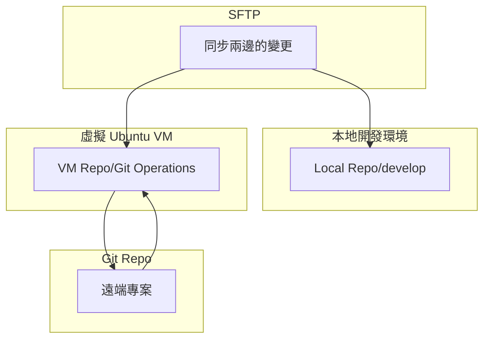

## 脈絡簡介

為了資安考量，以及同步開發環境，公司有以 ubantu 作為虛擬環境開發。

RD 跟資安工程團隊會幫開發組員成立虛擬帳號，對應的就是個人開發虛擬環境，比方我的就是 `home/jin`，`jin` 為帳號名稱，需要密碼才可以登入。

## 切換成虛擬環境

切換環境指令
```shell
$ ssh jin@92.168.26.124
```

輸入密碼

```shell
$ enter password: <password>
```

就會成功進入虛擬環境

```shell
jin@124rorGen3:~
```

可以在這個虛擬目錄下，clone 任何待開發或練習的專案：
```shell
$ git clone xxxx@github.com/xxxxx
```

:::info
可以把這個虛擬環境看成一個全新的電腦系統，所以客製化開發環境都要重做一遍，比方設定 github ssh key 或是客製化 terminal、設定 git 快捷指令等工作。
:::

## 開發流程

需在本地端成立開發專案夾，然後再同步虛擬環境下的專案，這個同步的橋樑需要依靠 vscode extension：`sftp`。

流程：

- 需要先在本地專案設定 `sftp.json`。
- 使用 `SFTP: List` 來從 vm 環境的專案抓取開發會用到的檔案夾（通常是 `app/`)
- 接著在本地專案開發
- 功能開發完之後，要將變更的部分同步到 vm repo
- 切換到 vm 環境處理 git 版本，並推到 github，請求 pull request。


> [!NOTE] 補充
> 可以想成 vm 環境有資安的屏蔽，所以要透過網路跟 github repo 溝通的部分要透過 vm，其餘的在本地備份下來的專案進行即可。




SFTP 同步做法參考資料：
- [VM with VSCode](https://docs.google.com/document/d/1lhywSyjR5w55q90pCuD2GAz5fc-Fm1FOshOUXZu8OPc/edit?tab=t.0#heading=h.3o4gge8c9g45)
- [Windows Vscode 開發環境部屬](https://kb.amastek.com.tw/books/7eacb/page/windows-vscode)

### 情境練習

- 同步修改過的檔案：sftp.json 內 `updateOnSave` 打開就會自動偵測修改並存檔的內容，自動備份到 vm 環境的 repo。
- 同步指定的空資料夾：`SFTP: Upload Folder`，注意 git 不會偵測空資料夾，所以要在空資料夾內加 `.gitkeep` 或 `keep` 檔，才可以 commit。
- 同步靜態資源：`SFTP: Sync Local -> Remote`。


# VM 閒置斷線

## 用 Screen 執行 VM 環境

當 SSH 連線斷掉時，原本運行的程序（如 Rails Server）會變成「孤兒程序」，它們還在後台跑，所以佔用了 Port，但卻已經失去了對它的控制權。

使用 `screen`可以建立一個「虛擬視窗」，即使斷線，Server 也會在 VM 內部持續運行，等下次登入時直接「接回去」就好。

### 建立 Screen

登入 VM 後，不要直接跑指令，先開一個命名好的 `screen`：

```shell
screen -S my_server
```

這會跳入一個看起來一模一樣的終端機，但這是一個受保護的空間。

### 啟動 Server


```shell
bin/dev <port> # 或 rails s
```

### 離開或斷線

- 離開：按下 `Ctrl + A` 接著按 `D`。你會回到原本的終端機，但 Server 還在跑。
- 斷線：如果 VM 閒置當掉，直接關掉視窗也沒關係，`screen` 會幫你守住那個程序。

### 重新連接

重新登入 VM ，輸入以下指令就能回到剛才的 Screen

```shell
screen -r my_server
```

或是先看有哪些 Screen：

```
screen -ls
```

透過列出來的 ID 重新連接：

```
screen -r 20451
```

 可以看到 Server 還在執行，就不需要重跑 server，或解決 port 佔用的問題。
 

### 清掉 Screen

如果登入後發現 `screen -r` 進不去，或者 Server 真的死掉了導致 Port 佔用，可以這樣清理：

強制清掉 screen

```shell
screen -wipe
```

或單純離開，先進入 Screen session 後輸入

```shell
exit
```


###  切換 Screen

Screen 除了繼承 shell 功能外，也有自己的額外功能，按 `ctrl + a` 再按功能鍵，就可以：

| 功能         | 功能鍵                         | 功能描述    |
| ---------- | --------------------------- | ------- |
| 暫離 session | `Ctrl + a`→`d`              | 背景執行並離開 |
| 新增視窗       | `Ctrl + a`→`c`              | 新增虛擬終端  |
| 下一個視窗      | `Ctrl + a`→`n`              | 切換下一個   |
| 上一個視窗      | `Ctrl + a`→`p`              | 切換上一個   |
| 列出視窗       | `Ctrl + a`→`"`              | 顯示所有視窗  |
| 滾動視窗       | `Ctrl + a`→`[`              | 瀏覽過往輸出  |
| 關閉視窗       | `Ctrl + a`→`k`→`y` 或 `exit` | 關閉目前視窗  |

> 該表單引用自：[# Linux Screen：多工終端常用指令](https://kb.amastek.com.tw/books/3-linux/page/linux-screen)


---

## tmux

現在開發者大多改用 **`tmux`**，因為它的介面較友善，且支援分割畫面。

- **開啟**：`tmux new -s dev`
- **離開**：`Ctrl + B` 接著按 `D`
- **接回**：`tmux attach -t dev`

## 修改 SSH 設定防止閒置斷線

1. 在本地電腦找到 SSH 設定檔：`~/.ssh/config`，如果沒有就建一下。
2. 加入以下設定：

```
Host *
  ServerAliveInterval 60
  ServerAliveCountMax 5
```

這樣本地 terminal 會每 60 秒自動傳一個訊號給 VM，防止它因為太無聊而斷線。
