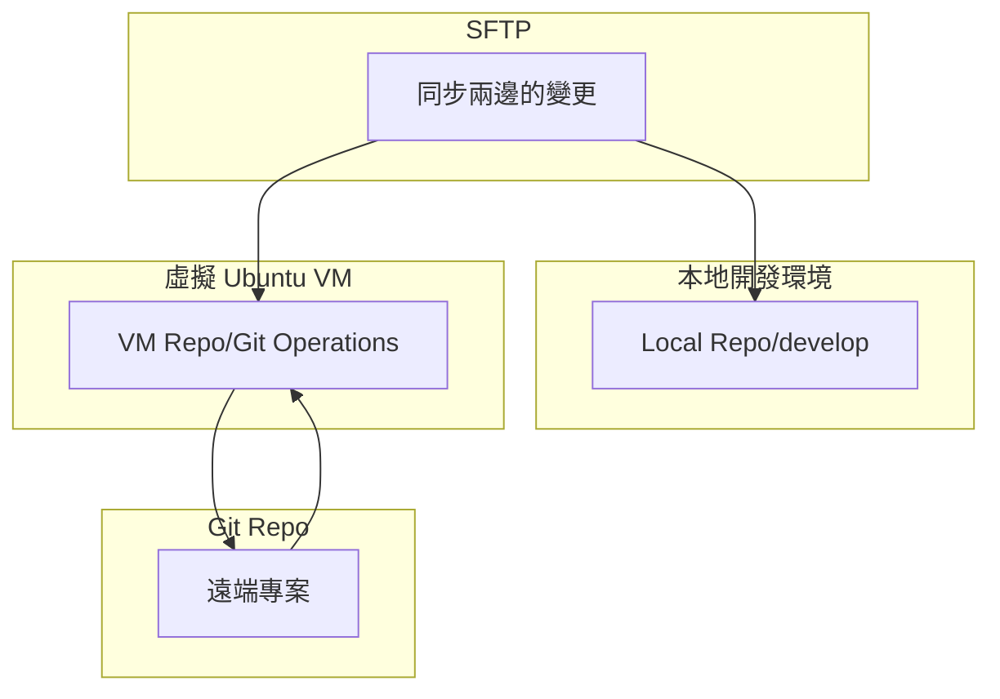

# 熟悉公司制度

## 例行會議

1.  每月第三個週一 早上 為月會
2.  每週一 11:30 專案開發會議
3.  每週三 下午 前端小組會議
4.  每週一 15:00 試用期 mentor 會議

### 實體會議

每季部門會議、績效面談、績效會議、職訓 1-2 天、尾牙

## 打卡

1.  前後半小時為彈性打卡時間，提早或延後都要寫原因
2.  加班打卡需要先告至主管
3.  補打卡（如果不在規定時間上下班也要寫事由）
4.  綁定 Line 可以機動打卡

## 回報

### 304 報表週更新

1.  進度
2.  預計要做
3.  灰色區待辦

### 日更新

1.  完成哪些事、遇到什麼困難
2.  每天 9:00-11:00 期間可以填
3.  Redmine 紀錄時數與詳細筆記

### 試用期學習報告

1.  週計畫
2.  月計畫

## 請假規則

1.  主旨格式：日期/假別/請假時數
2.  內容：開心就好 3.假別可以選
3.  生日假休了才有 1000 禮金，當月選一天
4.  注意一下時數是否正確
5.  附件要注意是否需要附上（目前還沒有特別規定要付）
6.  代理人可填：mentor
7.  主管選：RD - Rita
8.  請假要至少兩天前提出

### 特休

沒休完遞延一年

### 颱風假

遠端辦公可自行選擇：
- 不上班（不支薪）
- 待命（支薪，待命有工作時數可另行補假）
- 工作（可轉換有薪事假另行補休）

實體辦公：
- 工作時數轉換有薪事假
- 補助交通費

### 福利假

一個月只能請一天，給薪的，原則是不能有會議，沒休完就沒了

## 加班：

1.  要填主旨、內容、原因、日期
2.  加班補休期限一年
3.  加班要先跟主管報備

# 開發環境（VM）

## 脈絡簡介

為了資安考量，以及同步開發環境，公司有以 ubantu 作為虛擬環境開發。

RD 跟資安工程團隊會幫開發組員成立虛擬帳號，對應的就是個人開發虛擬環境，比方我的就是 `home/jin`，`jin` 為帳號名稱，需要密碼才可以登入。

## 切換成虛擬環境

切換環境指令
```shell
$ ssh jin@92.168.26.124
```

輸入密碼

```shell
$ enter password: <password>
```

就會成功進入虛擬環境

```shell
jin@124rorGen3:~
```

可以在這個虛擬目錄下，clone 任何待開發或練習的專案：
```shell
$ git clone xxxx@github.com/xxxxx
```

:::info
可以把這個虛擬環境看成一個全新的電腦系統，所以客製化開發環境都要重做一遍，比方設定 github ssh key 或是客製化 terminal、設定 git 快捷指令等工作。
:::

## 開發流程

需在本地端成立開發專案夾，然後再同步虛擬環境下的專案，這個同步的橋樑需要依靠 vscode extension：`sftp`。

流程：

- 需要先在本地專案設定 `sftp.json`。
- 使用 `SFTP: List` 來從 vm 環境的專案抓取開發會用到的檔案夾（通常是 `app/`)
- 接著在本地專案開發
- 功能開發完之後，要將變更的部分同步到 vm repo
- 切換到 vm 環境處理 git 版本，並推到 github，請求 pull request。


> [!NOTE] 補充
> 可以想成 vm 環境有資安的屏蔽，所以要透過網路跟 github repo 溝通的部分要透過 vm，其餘的在本地備份下來的專案進行即可。




SFTP 同步做法參考資料：
- [VM with VSCode](https://docs.google.com/document/d/1lhywSyjR5w55q90pCuD2GAz5fc-Fm1FOshOUXZu8OPc/edit?tab=t.0#heading=h.3o4gge8c9g45)
- [Windows Vscode 開發環境部屬](https://kb.amastek.com.tw/books/7eacb/page/windows-vscode)

### 情境練習

- 同步修改過的檔案：sftp.json 內 `updateOnSave` 打開就會自動偵測修改並存檔的內容，自動備份到 vm 環境的 repo。
- 同步指定的空資料夾：`SFTP: Upload Folder`，注意 git 不會偵測空資料夾，所以要在空資料夾內加 `.gitkeep` 或 `keep` 檔，才可以 commit。
- 同步靜態資源：`SFTP: Sync Local -> Remote`。


# 資訊安全

ISO 27001 今年導入，未來會陸續更多。可至 `shared document/91_ISO27001` 認識文件。跟工程是比較相關的是：
- 系統開發維護管理
- 網路安全
- 存取控制管理程序

## ISMS-2-011-2508

- 勁量設定雙因素驗證
- 雙因素驗證外（比方密碼 + 指紋），密碼需 180 天更改一次一次密碼，不得低於 8 個字元
- 桌面淨空（不可以在桌上留機密資料）、螢幕淨空（在公共空間使用電腦，電腦要在離開座位或一定時間，時間不可高於 5 分鐘內鎖定螢幕）
- 軟體安裝限制：整理出自己有用的軟體，給 Terence，確認安全性是沒問題的
- 禁止使用 P2P 傳輸檔案

# 專案開發流程

[文件](https://kb.amastek.com.tw/books/06905/page/6c4b7)

## 立案會議

- 提前閱讀 SA 規格書。
- 列出問題，並在立案會議提出。

## 工作紀錄與追蹤

評估工時。並列在 [303_工程師議題追蹤工程](https://docs.google.com/spreadsheets/d/1_URz1Lnvzx4__izw17bwoDaOZRaE_vyNiaMRM50w-QI/edit?gid=0#gid=0)。
   - 如果有 bug 或 issue，就開在 redmine。修好之後，要在 slack tag QA 來複測。接著等待 PM 跟客戶確認時間更新。（更新部署是由後端執行）
   - slack 內的白板會有每日開發的項目（包含功能、bug、issue），可以針對項目對話。
   - redmine 比較是結論式的開卡（只有測試後的 bug 跟 issue），還有工時的紀錄。

## 開發前期

前端需要準備畫面的測試文件，也就是這個畫面需要確認哪些內容。
也要確認後端的 SDS 文件。

## 開發中期

前端撰寫[測試文件（excel 表單）](https://docs.google.com/spreadsheets/d/1y-TrwXaSq6wxKpeCanGqHseAr_KYZsuz/edit?gid=1567323607#gid=1567323607)。
- 用 playwright e2e 的概念，撰寫測試文件。
- 未來要寫測試腳本

[課程連結](https://www.youtube.com/playlist?list=PL6Yp0wE6Up7S9gcG0107Z7z0GN8nJjRp-)


## 開發後期

前端撰寫[使用手冊（給客戶看的）](https://docs.google.com/document/d/1TA9kHLZQxZ-8H0qgxrbyrS2uktSpRhSZQNJOGgAJqn8/edit?tab=t.0)，可以檢附圖片或影片。

## 系統上線

完備使用手冊。


# 訓練期間疑問

## 本地專案無法 install
vm 專案跑 `bundle install` 跟 `yarn install` 都沒問題，但本地專案無法，會一直 timeout。

目前是起來是 IPV6 的問題，回復預設（打開）：

```shell
$ sudo networksetup -setv6automagic Wi-Fi
```

關閉：

```shell
$ sudo networksetup -setv6off Wi-Fi
```

關閉才能夠安裝，不然就會有 timeout 的問題。
 
